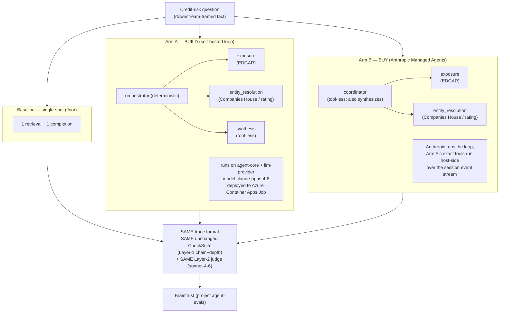

# Build vs buy — visual summary

Companion visuals for [`../SCORECARD.md`](../SCORECARD.md). All figures are from
the same live 3-way run over all 10 fixtures (`make compare`). Numbers here match
the scorecard exactly — these charts add nothing beyond it, they just show it.

## The three arms



## Task quality — a tie (branch-correct, out of 10)

Higher is better. Both agents win the same seven fixtures.

```
baseline   ###                          3 / 10
arm-a      #######                      7 / 10   (build)
arm-b      #######                      7 / 10   (buy)
```

Groundedness (>=2/3), out of 10:

```
baseline   ####                         4 / 10
arm-a      #########                    9 / 10   (build)
arm-b      ##########                  10 / 10   (buy)
```

## Cost per run — buy is ~4x build

Lower is better. Bars scaled to $3.33 = 40 chars.

```
baseline   ###                          $0.28
arm-a      ##########                   $0.83   (build)
arm-b      ########################################  $3.33   (buy, ~4x)
```

## Latency — buy is ~3.4x build

Wall-clock for all 10 fixtures, lower is better. Bars scaled to 963 s = 40 chars.

```
baseline   ######                       135 s
arm-a      ############                 287 s   (build)
arm-b      ########################################  963 s   (buy, ~3.4x)
```

## The decisive non-quality axis: residency

| Arm | Loop runs on | Retrieved content seen by | ZDR / HIPAA |
|---|---|---|---|
| Arm A (build) | operator infra (ACA Job) | operator infra only | eligible |
| Arm B (buy) | Anthropic | Anthropic inference layer | **ineligible** |

A **self-hosted MA sandbox** does **not** change Arm B's row: it relocates only
built-in tool execution (unused here — retrieval is host-side custom tools),
while the loop and inference stay on Anthropic. It recovers no residency, no
measured performance, and adds maintenance — so it was **evaluated and rejected,
not built**. See the scorecard for the full reasoning.

## Verdict

Build and buy **tie on task quality**; the choice is a **residency / cost /
latency vs maintenance** trade. Full reasoning and the "when to choose" guidance:
[`../SCORECARD.md`](../SCORECARD.md).
</content>
