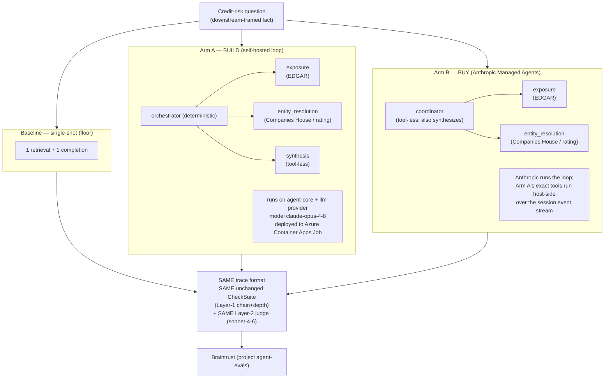

# Build vs buy — visual summary

Companion visuals for [`../SCORECARD.md`](../SCORECARD.md). All figures are from
the same live 3-way run over all 10 fixtures (`make compare`). Numbers here match
the scorecard exactly — these charts add nothing beyond it, they just show it.

## The three arms



## Task quality — a tie (branch-correct, out of 10)

Higher is better. Both agents win the same seven fixtures.

```
baseline   ###                          3 / 10
arm-a      #######                      7 / 10   (build)
arm-b      #######                      7 / 10   (buy)
```

Groundedness (>=2/3), out of 10:

```
baseline   ####                         4 / 10
arm-a      #########                    9 / 10   (build)
arm-b      ##########                  10 / 10   (buy)
```

## Cost per run — buy is ~4x build

Lower is better. Bars scaled to $3.33 = 40 chars.

```
baseline   ###                          $0.28
arm-a      ##########                   $0.83   (build)
arm-b      ########################################  $3.33   (buy, ~4x)
```

## Latency — buy is ~3.4x build

Wall-clock for all 10 fixtures, lower is better. Bars scaled to 963 s = 40 chars.

```
baseline   ######                       135 s
arm-a      ############                 287 s   (build)
arm-b      ########################################  963 s   (buy, ~3.4x)
```

## The decisive non-quality axis: residency

| Arm | Loop runs on | Retrieved content seen by | ZDR / HIPAA |
|---|---|---|---|
| Arm A (build) | operator infra (ACA Job) | operator infra only | eligible |
| Arm B (buy) | Anthropic | Anthropic inference layer | **ineligible** |

A **self-hosted MA sandbox** does **not** change Arm B's row: it relocates only
built-in tool execution (unused here — retrieval is host-side custom tools),
while the loop and inference stay on Anthropic. It recovers no residency, no
measured performance, and adds maintenance — so it was **evaluated and rejected,
not built**. See the scorecard for the full reasoning.

## Signature visual — one investigation's branching trace (indeterminacy)

The whole thesis is that the investigation **path cannot be pre-written**: a hop's
result determines the next hop. The clearest example is **hertz** — a *genuine
discovery* fixture where the SEC filing does **not** name the target UK entity, so
the agent must *branch into a registry search* to discover it before it can
resolve it. Reconstructed from the fixture's verified `ground_truth_path`
(`fixtures/fixtures.yaml`); a real Arm A run traverses exactly this shape
(`edgar_filing` → `companies_house` ×3, depth 4). Sub-agent owning each hop in
`[brackets]`.

```mermaid
flowchart TD
    S["START: 'Hertz funded UK ops through a UK<br/>receivables-financing subsidiary — identify it<br/>and which bank holds its charges'"]
    H1["HOP 1 · edgar_filing  [exposure]<br/>Chapter 11 8-K (Item 1.03)"]
    D1{"Does the 8-K name the<br/>UK receivables entity?"}
    BR["NO — 8-K carves out non-US subs as a<br/>CLASS (names only Hertz International Ltd +<br/>Hertz Holdings Netherlands BV).<br/>⇒ the entity must be DISCOVERED"]
    H2["HOP 2 · companies_house SEARCH  [entity_resolution]<br/>q='Hertz receivables' → discovers<br/>HERTZ UK RECEIVABLES LTD (08789381)"]
    D2{"Unique receivables entity found?"}
    H3["HOP 3 · companies_house PROFILE  [entity_resolution]<br/>confirm CH 08789381 active, has charges"]
    H4["HOP 4 · companies_house CHARGES  [entity_resolution]<br/>holder = Credit Agricole CIB"]
    D3{"Charge holder identified?"}
    SY["SYNTHESIS  [coordinator / tool-less]<br/>compose grounded answer — NO further retrieval"]
    STOP(["STOP at depth 4 ✓"])

    S --> H1 --> D1
    D1 -->|"the branch point:<br/>result unknown until fetched"| BR --> H2 --> D2
    D2 -->|yes| H3 --> H4 --> D3
    D3 -->|yes| SY --> STOP
```



**Why this proves indeterminacy:** after HOP 1 the agent does **not** know the
entity name — HOP 2 is a *search* whose result (which company) is what makes HOP 3
addressable. No static script could have named CH 08789381 in advance; the path is
data-dependent. (The baseline, with one retrieval, halts at HOP 1 and cannot
reach the answer — which is why it scores 0/3 here.) The stop is equally
load-bearing: synthesis is **tool-less**, so it structurally cannot add a HOP 5 —
the over-investigation guard the controls/trap exist to test.

### Per-sub-agent token attribution

Exact per-hop token integers are recorded in the run trace's per-`claude_response`
events (summed by `agent_managed/metrics.py:tokens_from_trace`); the **authoritative
totals are the per-arm figures in the table above** ($/run and token columns). The
*structural* attribution — which hops, and therefore which share of tokens, belong
to which sub-agent — is:

| Sub-agent | Hops it owns (hertz) | Tools | Token profile |
|---|---|---|---|
| **exposure** | HOP 1 (the 8-K) | `edgar_*` | one filing/exhibit round-trip; modest |
| **entity_resolution** | HOPs 2–4 (search → profile → charges) | `companies_house`, `external_rating` | the bulk of retrieval tokens on multi-hop UK fixtures |
| **synthesis / coordinator** | final compose (no retrieval) | none | output-heavy, input-light |

The build-vs-buy consequence is visible in the totals: Arm B runs the same
three-role shape but as a **coordinator + two sub-agent threads each holding their
own context**, which is why its output tokens are ~5.4x Arm A's (74,462 vs 13,720)
and its cost ~4x — the fan-out is the price of the managed loop, not a difference
in the investigation.

## Verdict

Build and buy **tie on task quality**; the choice is a **residency / cost /
latency vs maintenance** trade. Full reasoning and the "when to choose" guidance:
[`../SCORECARD.md`](../SCORECARD.md).
</content>
